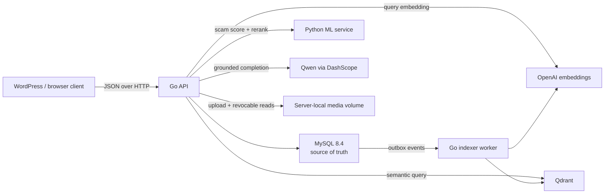

# LoopBuy Go backend

This directory contains the standalone LoopBuy application backend. It owns its own MySQL schema, authentication, marketplace CRUD, buyer/seller messaging, scam screening, recommendations, vector indexing, and RAG shopping assistant. It is separate from the WordPress/MariaDB database used by the site shell.

The HTTP contract is documented in [`openapi.yaml`](./openapi.yaml).

## Architecture



The main runtime components are:

- `cmd/api`: process startup, dependency wiring, migrations, HTTP server, graceful shutdown, and the indexer worker.
- `internal/httpapi`: versioned REST routes, JWT middleware, request validation, CORS, and RFC 9457-style problem responses.
- `internal/store`: MySQL persistence and transactions.
- `internal/ai`: small REST clients for OpenAI embeddings, Qdrant, and Qwen's OpenAI-compatible chat API.
- `internal/indexer`: transactional-outbox consumer that keeps listing vectors in Qdrant synchronized with MySQL.
- `internal/ml`: client for the separate FastAPI service in `../ml-service`.
- `internal/media`: validated image uploads, traversal-safe revocable reads, scoped deletion, and local demo-photo installation.
- `migrations`: embedded, forward-only MySQL migrations.

MySQL remains the source of truth. Qdrant contains a rebuildable search index, not canonical listing data. The assistant retrieves only listings that are both `active` and moderation `approved`, then sends that bounded context to Qwen.

### Listing write and moderation flow

1. The API validates the listing and calls `POST /v1/scam/predict` on the ML service.
2. A `low_risk` result creates or updates the listing as `active` / `approved`; every other result becomes `under_review` / `pending`.
3. The listing, assessment, images, and `listing.upsert` outbox event are committed together in MySQL.
4. The background worker embeds eligible listing text with OpenAI and upserts the named vector in Qdrant. Ineligible, rejected, sold, or archived listings have their vector removed.
5. Failed index operations remain in the outbox and are retried with exponential backoff capped at 300 seconds.

Every listing response includes a monotonically increasing `revision`. `PATCH /api/v1/listings/{id}` requires the client to copy the current positive revision into the JSON body. Omitting it (or sending zero) returns HTTP 428; sending a stale value returns HTTP 409, so the client must reload the listing and reapply the intended edit. Scam reassessment captures its starting revision internally. Status, moderation, image, content, and reassessment mutations all advance the revision, preventing a slow ML-backed write from overwriting newer state.

For example, if the latest `GET /api/v1/listings/42` response contains `"revision": 7`, a price-only edit is:

```http
PATCH /api/v1/listings/42 HTTP/1.1
Authorization: Bearer <access_token>
Content-Type: application/json

{
  "revision": 7,
  "price": 149.90
}
```

The successful response contains the next revision. If another mutation wins first, discard the stale representation, fetch the latest listing, and retry only after reconciling the user's edit.

The bundled scam model is a transparent TF-IDF/logistic-regression baseline augmented with explicit lexical risk signals. It is a screening aid, not proof of fraud and not a production-grade auto-ban system.

### Local listing-image flow

Sellers create a listing without an `images` array, then send one file at a time to `POST /api/v1/listings/{id}/images/upload` as `multipart/form-data`. The required field is `image`; optional `sort_order` accepts `0..1000` and `is_primary` accepts a boolean. If order is omitted, the first free value is selected. Only the owner or an administrator can upload.

JPEG, PNG, WebP, and GIF are accepted up to `MEDIA_MAX_UPLOAD_BYTES` (8 MiB by default). The implementation compares magic bytes with the filename extension, ignores the client filename when choosing storage, generates a 128-bit random object name, and commits through a temporary file. SVG uploads are deliberately rejected. Successful responses use the normal `ListingImage` DTO with a URL such as `/media/listings/42/0123456789abcdef0123456789abcdef.webp`.

`GET`/`HEAD /media/...` serves only strict generated keys through Go's rooted filesystem API, supports conditional/range requests, and sets `nosniff` plus a restrictive CSP. Before serving a generated user upload, the API verifies that MySQL still contains the exact `(listing_id, image_url)` reference; orphaned or interrupted-upload files therefore return `404` even if bytes remain on disk. Versioned repository demo photos use a one-year immutable cache policy. Revocable user uploads use `private, no-store`, so shared/browser caches are not instructed to retain a photo after listing or account deletion. Deleting an attached image removes its generated file after the image-row transaction commits.

Account deletion is fail-closed for listing media. The account transaction locks the user and all owned listings, removes every owned listing upload directory before commit, deletes every corresponding `listing_images` row, archives the listings, and only then anonymizes the account. A filesystem cleanup failure rolls the database transaction back and returns an error; a later database failure may leave a broken DB reference, but never a successfully deleted account with origin files still exposed. Cleanup is listing-ID scoped through Go's rooted filesystem API, so one seller cannot delete another seller's directory. The legacy JSON URL endpoint remains administrator-only for reviewed imports; sellers cannot attach arbitrary third-party URLs, avoiding broken cards and visitor-IP leakage to image hosts.

### Recommendation and RAG flow

- `GET /api/v1/recommendations` uses `q`, or the authenticated user's recent favourites/cart content when `q` is absent.
- The query is embedded with OpenAI, searched in Qdrant with active/approved filters, loaded again from MySQL, and optionally reranked by the local ML service.
- `POST /api/v1/assistant/chat` and the persisted chat-session endpoints retrieve up to eight current listings, encode them as untrusted JSON context, and ask Qwen to answer only from that context.
- Every assistant response includes source listing IDs and a `degraded` flag. Persisted sessions save the user/assistant exchange, provider model, token counts, and sources.

## Requirements

- Docker Desktop or another Docker Engine with Compose v2 for the supported local stack.
- Go 1.25 for running the API outside Docker.
- Python 3.12 for running the ML service outside Docker.
- Provider credentials only when semantic search and Qwen answers are required.

## Configuration

Copy the repository-level example before starting Compose:

```powershell
Copy-Item .env.example .env
```

Replace all `change-*` and `replace-*` placeholders. Never commit `.env`. `JWT_SECRET` is mandatory and must contain at least 32 characters. Provider keys must stay server-side and must never be exposed to WordPress templates or browser JavaScript.

### API environment

| Variable | Default | Meaning |
| --- | --- | --- |
| `HTTP_ADDR` | `:8080` | API listen address inside the process. |
| `DATABASE_DSN` | constructed from `BACKEND_DB_*` | Full Go MySQL DSN override. The named database must already exist. |
| `BACKEND_DB_HOST` | `backend-db` | MySQL host used when `DATABASE_DSN` is absent. |
| `BACKEND_DB_PORT` | `3306` | MySQL port used when `DATABASE_DSN` is absent. |
| `BACKEND_DB_NAME` | `loopbuy_backend` | Separate backend database name. |
| `BACKEND_DB_USER` | `loopbuy` | Backend database user. |
| `BACKEND_DB_PASSWORD` | local-only fallback | Backend database password. Set an explicit value outside throwaway development. |
| `JWT_SECRET` | none | Required HS256 signing secret; startup fails when shorter than 32 characters. |
| `ACCESS_TOKEN_TTL` | `15m` | Go duration for access-token lifetime. |
| `REFRESH_TOKEN_TTL` | `720h` | Go duration for refresh-token lifetime. |
| `CORS_ALLOWED_ORIGINS` | `http://localhost:8080` | Comma-separated exact origin allowlist. |
| `MEDIA_STORAGE_ROOT` | `/var/lib/loopbuy/media` | Writable server-local root mounted from the persistent `listing_media_data` volume. Never point it at a filesystem root. |
| `MEDIA_PUBLIC_BASE_URL` | `/media` | Public URL prefix stored in image DTOs. It may be an absolute HTTP(S) URL but its path must end in `/media`. |
| `MEDIA_MAX_UPLOAD_BYTES` | `8388608` | Per-image limit in bytes; accepted range is 1 byte through 25 MiB. |
| `DEMO_SEED_ENABLED` | `false` in the binary; Compose enables it | Installs the idempotent presentation catalogue and repairs the historical exact `example.com/headphones.jpg` placeholder. |
| `DEMO_MEDIA_SOURCE_DIR` | `/opt/loopbuy/demo-media` | Read-only directory containing the repository-owned product photos copied into persistent media storage. |
| `GOOGLE_CLIENT_ID` | none | Google Web OAuth client ID. Configure together with the secret and redirect allowlist. |
| `GOOGLE_CLIENT_SECRET` | none | Google Web OAuth client secret; server-side only. |
| `GOOGLE_REDIRECT_URIS` | none | Comma-separated exact callback allowlist. HTTPS is required except for loopback development URLs. |
| `BFF_SHARED_SECRET` | none | Independent 32+ character HMAC secret shared only by WordPress and the API; authenticates opaque per-client rate-limit buckets without forwarding raw visitor IPs. |
| `RESEND_API_KEY` | none | Server-side Resend sending key. When absent, password registration reports email delivery unavailable. |
| `RESEND_BASE_URL` | `https://api.resend.com` | Resend REST root; only HTTPS is accepted except in loopback tests. |
| `RESEND_FROM` | none | Verified sender, for example `LoopBuy <auth@loopbuy.store>`. |
| `RESEND_MAX_EMAILS_PER_HOUR` | `100` | Shared MySQL-backed hourly cap across registration and resend deliveries for all API replicas. |
| `EMAIL_VERIFICATION_URL` | none | Public WordPress page that receives `?token=...` and explicitly POSTs it to the backend. Use `/login/` for the current BFF. |
| `EMAIL_VERIFICATION_TTL` | `24h` | Positive Go duration for a single-use verification token. |
| `OPENAI_API_KEY` | none | Enables embeddings, vector indexing, and semantic retrieval. |
| `OPENAI_BASE_URL` | `https://api.openai.com` | API root; the client appends `/v1/embeddings`. |
| `OPENAI_EMBEDDING_MODEL` | `text-embedding-3-small` | Embedding model recorded with index state. |
| `OPENAI_EMBEDDING_DIMENSIONS` | `1536` | Positive vector size; must match the Qdrant named vector. |
| `OPENAI_MAX_REQUESTS_PER_HOUR` | `300` | MySQL-backed global hourly cap shared by interactive retrieval, the indexer, and all API replicas. |
| `OPENAI_MAX_REQUESTS_PER_USER_DAY` | `20` | Per-user daily OpenAI request cap; index work is charged to the listing seller. |
| `QDRANT_URL` | `http://qdrant:6333` | Qdrant REST root. |
| `QDRANT_API_KEY` | none | Optional `api-key` header. Compose configures one by default for local use. |
| `QDRANT_COLLECTION` | `loopbuy_listings_v1` | Collection owned by this backend. |
| `QDRANT_VECTOR_NAME` | `listing_text_v1` | Named dense vector used for listing text. |
| `ML_SERVICE_URL` | `http://ml:8000` | Internal FastAPI service root. |
| `QWEN_API_KEY` | falls back to `DASHSCOPE_API_KEY` | Preferred Qwen credential variable. |
| `DASHSCOPE_API_KEY` | none | Alias used when `QWEN_API_KEY` is empty. |
| `QWEN_BASE_URL` | none | Required to enable Qwen; use the region-specific OpenAI-compatible `/compatible-mode/v1` root. |
| `QWEN_MODEL` | `qwen3.7-plus` | Qwen model identifier. |
| `QWEN_MAX_REQUESTS_PER_HOUR` | `100` | MySQL-backed global hourly Qwen completion cap shared by all API replicas. |
| `QWEN_MAX_REQUESTS_PER_USER_DAY` | `10` | Per-user daily Qwen completion cap. |
| `AI_CHAT_FALLBACK_ENABLED` | `true` | Allows deterministic listing results when Qwen is absent or fails. |
| `OUTBOX_POLL_INTERVAL` | `2s` | Go duration between indexer drains. |

Compose also uses `API_PORT` (default `8090`) and `BACKEND_DB_ROOT_PASSWORD`. The optional `compose.debug.yaml` overlay uses `BACKEND_DB_EXPOSE_PORT` (default `3307`) and `QDRANT_PORT` (default `6333`) for loopback-only diagnostics. The repository's WordPress variables still need values because Compose interpolates the complete project file even when only backend services are selected.

Durations use Go syntax such as `15m`, `2s`, or `720h`. Invalid duration values, embedding dimensions, or provider request limits stop startup. Provider request limits must be between 1 and 100,000. An invalid boolean for `AI_CHAT_FALLBACK_ENABLED` currently falls back to `true`.

For the current WordPress BFF, use these exact callback/link bases per environment (the backend appends the verification `token` query parameter):

```dotenv
# Local
GOOGLE_REDIRECT_URIS=http://localhost:18080/wp-json/loopbuy/v1/auth/google/callback,http://localhost:8080/wp-json/loopbuy/v1/auth/google/callback,https://loopbuy.store/wp-json/loopbuy/v1/auth/google/callback
EMAIL_VERIFICATION_URL=http://localhost:18080/login/

# Production uses the same redirect allowlist and this verification page:
# EMAIL_VERIFICATION_URL=https://loopbuy.store/login/
```

## Database and migrations

The Compose service `backend-db` provisions the database itself. The API then runs embedded migrations automatically before it starts listening:

- `001_init.sql` creates 19 application/support tables for users, profiles, categories, listings, images, favourites, carts, conversations, messages, sessions, interactions, AI chat, scam assessments, embedding state, and the outbox. It also creates the `ftx_listings_search` FULLTEXT index over listing title, description, and brand.
- `002_seed_categories.sql` inserts Gaming, Fashion, Sports, Home Appliances, Electronics, Books, Furniture, and Others.
- `003_outbox_leases_and_cosine_scores.sql` adds claim leases for safe multi-replica outbox processing and permits the full `[-1, 1]` Qdrant cosine-score range in persisted chat sources.
- `004_listing_revisions.sql` adds the positive `listings.revision` counter used to reject stale content edits and automated reassessment results.
- `005_account_verification_and_identities.sql` trusts existing accounts as a one-time verified legacy backfill, keeps new password accounts pending, and adds single-use verification tokens plus stable provider identities.
- `006_demo_seed_registry.sql` records stable optional demo-listing keys so repeated startup seeding does not duplicate listings or enqueue repeat embedding work.
- `007_outbox_embedding_retry_safety.sql` caches paid embeddings across Qdrant retries and dead-letters events after a bounded attempt count.
- `008_email_delivery_budget.sql` provides the shared hourly verification-email budget used by every API replica.

The migration runner creates `schema_migrations`, serializes concurrent processes with the MySQL advisory lock `loopbuy_backend_schema_migrations`, and validates each applied filename and SHA-256 checksum. Do not edit an already-applied migration; add the next zero-padded migration instead.

MySQL DDL commits implicitly. If a DDL migration fails halfway, inspect the schema before retrying because earlier statements may already be committed. There is intentionally no automatic destructive rollback.

The legacy `C:\Users\mixai\Downloads\loopbuy_db.sql` file is not read or imported by this backend. Data migration from an older schema should be implemented as a reviewed forward migration or one-off ETL, not by importing it over `loopbuy_backend`.

## Start with Docker Compose

From the repository root:

```powershell
docker compose config --quiet
docker compose up --build -d backend-db qdrant ml api
docker compose ps
```

This starts only the backend stack:

- API: `http://localhost:8090`
- MySQL, Qdrant, and the ML service: reachable only on the internal Docker network

The base Compose file deliberately does not publish database or Qdrant ports. For loopback-only database/Qdrant diagnostics, include the debug overlay:

```powershell
docker compose -f compose.yaml -f compose.debug.yaml up -d backend-db qdrant
```

That exposes MySQL at `127.0.0.1:3307` and Qdrant at `127.0.0.1:6333` by default. Do not use the debug overlay on a public host.

Follow logs with:

```powershell
docker compose logs -f api ml backend-db qdrant
```

Stop containers without deleting data:

```powershell
docker compose stop api ml qdrant backend-db
```

Removing Compose volumes deletes the backend database, vector index, and uploaded listing media. Do that only when a disposable reset is explicitly intended.

### Run the API outside Docker

Start `backend-db` and `qdrant` with the debug overlay, run the ML service directly on the host, then run from `backend`. A full `DATABASE_DSN` is the least ambiguous option:

```powershell
$env:DATABASE_DSN = 'loopbuy:YOUR_PASSWORD@tcp(127.0.0.1:3307)/loopbuy_backend?parseTime=true&collation=utf8mb4_0900_ai_ci&loc=UTC'
$env:JWT_SECRET = 'REPLACE_WITH_AT_LEAST_32_RANDOM_CHARACTERS'
$env:QDRANT_URL = 'http://127.0.0.1:6333'
$env:ML_SERVICE_URL = 'http://127.0.0.1:8000'
go run ./cmd/api
```

The ML service is not published by either Compose file, so run it directly with Uvicorn or add a separate loopback-only override when using this mode.

## API conventions

- Base path: `/api/v1`; health endpoints are `/health/live` and `/health/ready`.
- Authentication: `Authorization: Bearer <access_token>` using an HS256 JWT. Every authenticated request rechecks the user's active role and verified-email state in MySQL, so suspension/deletion and verification changes take effect without waiting for JWT expiry. Refresh tokens are opaque, stored only as SHA-256 hashes, rotated on refresh, and revoked on logout only when they belong to the authenticated user.
- Password registration creates no session until a versioned HMAC-signed, single-use verification token is consumed. The database stores only its SHA-256 hash and expiry; the HMAC uses the JWT secret with domain separation. Resend receives the raw token only inside the HTTPS link; neither the raw token nor provider keys are logged. Resend requests use a bounded client timeout and an idempotency key.
- Google sign-in requires an authorization code, a 43-128-character PKCE verifier, and an exact allowlisted redirect URI. The backend exchanges the code, validates Google's signed ID token (`aud`, `iss`, `exp`, `sub`, and verified email), and never persists Google access/refresh tokens. Existing accounts are auto-linked only for Google-authoritative Gmail or matching Workspace-domain addresses; ambiguous matches return 409 instead of risking account takeover.
- Auth endpoints combine a high proxy-wide/IP ceiling with tighter hashed email/token buckets. This preserves brute-force controls without forcing every browser behind the WordPress BFF into one 8- or 12-request bucket.
- Logout revokes refresh tokens; an already issued access JWT remains valid until its short expiry. Account deletion is immediate because every protected request also checks active account state; it also deletes all owned listing image rows and locally generated upload directories before reporting success.
- JSON request bodies are limited to 1 MiB, reject unknown fields, and must contain exactly one object.
- Errors use `application/problem+json` with `type`, `title`, `status`, `detail`, and `instance`.
- Integer path identifiers must be positive. Category lookup accepts either a numeric ID or slug; category update/delete require the numeric form.
- `X-Request-ID` is echoed when valid (up to 128 characters) or generated by the API.
- Public listing reads expose only active, approved listings. A seller authenticated with their own `seller_id` filter can also see their non-public listings; admins can read a non-public listing by ID.
- Listing and moderation-queue `q` filters use the MySQL natural-language FULLTEXT index and accept at most 120 characters. Their shared `offset` is capped at 10,000.

Access legend used below: **public**, **optional** (works anonymously but uses a valid bearer token when supplied), **bearer**, **moderator** (moderator or admin), and **admin**.

## Route map

The current Go server registers **61 method/path operations** (including the two health endpoints and the media read route). The table groups operations that share a path.

| Method | Path | Access | Purpose |
| --- | --- | --- | --- |
| `GET` | `/health/live` | public | Process liveness. |
| `GET` | `/health/ready` | public | Required MySQL/ML/Qdrant readiness plus optional embeddings, Qwen, Google OAuth, and email-delivery configuration state. Provider readiness is configuration-only and does not spend an external request. |
| `GET`/`HEAD` | `/media/{path...}` | public | Serve a strict local image key; generated uploads additionally require an exact live MySQL image reference, use `private, no-store`, and return 404 when orphaned. Demo media is immutable, and arbitrary filesystem paths/directories are rejected. |
| `POST` | `/api/v1/auth/register` | public | Create an unverified user/profile/cart, send a Resend verification email, and return 202 without tokens. |
| `POST` | `/api/v1/auth/login` | public | Authenticate by email/password and issue tokens. |
| `POST` | `/api/v1/auth/google` | public | Exchange a Google code plus PKCE verifier and issue a LoopBuy token pair. |
| `POST` | `/api/v1/auth/email/verify` | public | Consume a single-use token in the JSON body; GET intentionally does not mutate verification state. |
| `POST` | `/api/v1/auth/email/resend` | public | Issue and resend a token with an enumeration-resistant generic 202 response; consuming one link invalidates the rest. |
| `POST` | `/api/v1/auth/refresh` | public | Rotate a refresh token and issue a new token pair. |
| `POST` | `/api/v1/auth/logout` | bearer | Revoke one refresh token. |
| `POST` | `/api/v1/auth/logout-all` | bearer | Revoke all refresh tokens for the user. |
| `GET`, `POST` | `/api/v1/categories` | public / admin | List active categories or create one. |
| `GET`, `PATCH`, `DELETE` | `/api/v1/categories/{identifier}` | public / admin / admin | Read by ID or slug; update or soft-delete by numeric ID. |
| `GET`, `POST` | `/api/v1/listings` | optional / bearer | Browse/filter listings or create one. |
| `GET`, `PATCH`, `DELETE` | `/api/v1/listings/{id}` | optional / bearer / bearer | Read, edit with a required current `revision`, or archive a listing. Missing revision returns 428; stale revision returns 409. Seller ownership is enforced; admins may edit/archive. |
| `PATCH` | `/api/v1/listings/{id}/status` | bearer | Set `active`, `sold`, or `archived`; activation requires approved moderation. |
| `GET`, `POST` | `/api/v1/listings/{id}/images` | optional / admin | List visible listing images or perform a reviewed legacy URL import. |
| `POST` | `/api/v1/listings/{id}/images/upload` | bearer | Owner/admin multipart upload to persistent local storage; validates size, extension, and magic bytes. |
| `PATCH`, `DELETE` | `/api/v1/listings/{id}/images/{imageId}` | bearer | Update local image ordering/primary state or remove its database row and managed file. URL replacement is admin-only. |
| `POST` | `/api/v1/listings/{id}/scam-assessments` | bearer | Rerun screening and update moderation state. |
| `GET` | `/api/v1/listings/{id}/scam-assessments/latest` | bearer | Read latest assessment as seller/admin. |
| `GET` | `/api/v1/admin/listings` | moderator | List/filter the moderation queue; admins are also allowed. |
| `PATCH` | `/api/v1/admin/listings/{id}/moderation` | moderator | Approve, reject, or return a listing to review; admins are also allowed. |
| `GET` | `/api/v1/listings/{id}/similar` | bearer | Semantic similar listings, with recent-listing fallback. |
| `GET`, `PATCH`, `DELETE` | `/api/v1/users/me` | bearer | Read, update, or privacy-delete the current account; deletion removes owned image rows/files before anonymizing. |
| `GET` | `/api/v1/users/{id}` | public | Read a public profile; email, role, status, and phone are hidden. |
| `GET` | `/api/v1/users/me/favourites` | bearer | List saved active/approved listings. |
| `PUT`, `DELETE` | `/api/v1/users/me/favourites/{listingId}` | bearer | Idempotently save or remove a listing. |
| `GET` | `/api/v1/users/me/cart` | bearer | Read the current cart. |
| `PUT`, `PATCH`, `DELETE` | `/api/v1/users/me/cart/items/{listingId}` | bearer | Set quantity (1-99) or remove an item. |
| `DELETE` | `/api/v1/users/me/cart/items` | bearer | Clear the cart. |
| `POST`, `GET` | `/api/v1/conversations` | bearer | Open/reuse a conversation for an active/approved listing or list active memberships. |
| `GET`, `DELETE` | `/api/v1/conversations/{id}` | bearer | Read a conversation or leave it without deleting its history. |
| `GET`, `POST` | `/api/v1/conversations/{id}/messages` | bearer | Cursor-list or create messages. |
| `PATCH`, `DELETE` | `/api/v1/conversations/{id}/messages/{messageId}` | bearer | Edit or soft-delete one's own message. |
| `GET` | `/api/v1/recommendations` | bearer | Personalized or query-based recommendations. |
| `POST` | `/api/v1/assistant/chat` | bearer | Stateless RAG chat. |
| `POST`, `GET` | `/api/v1/ai/chat/sessions` | bearer | Create or list persisted assistant sessions. |
| `GET`, `PATCH`, `DELETE` | `/api/v1/ai/chat/sessions/{id}` | bearer | Read, rename, or delete an owned session. |
| `GET`, `POST` | `/api/v1/ai/chat/sessions/{id}/messages` | bearer | List messages or persist a new RAG exchange. |

See [`openapi.yaml`](./openapi.yaml) for parameters, request bodies, response schemas, and status codes.

## Provider contracts and fallbacks

| Dependency | Outbound contract | Failure behavior |
| --- | --- | --- |
| Google OAuth | `POST https://oauth2.googleapis.com/token` with server client credentials, one-time code, PKCE verifier, and exact redirect URI; signed ID token validation against the configured audience. | Missing configuration returns 503. Invalid/replayed grants return a uniform 401. Ambiguous or unsafe account linking returns 409. |
| Resend | `POST {RESEND_BASE_URL}/emails` with a bearer sending key, verified `from`, text+HTML bodies, and `Idempotency-Key`. | Registration returns 503 if the account was created but delivery failed, allowing `/auth/email/resend`; resend itself keeps a generic 202 to prevent enumeration. |
| OpenAI embeddings | `POST {OPENAI_BASE_URL}/v1/embeddings`; bearer key; model, string-array input, `encoding_format: float`, and configured dimensions. Every outbound request first reserves shared global-hour and per-user-day budget in MySQL. | With no key, the indexer is disabled. Embed/query or budget-check failures make recommendations fall back to recent approved listings with `degraded: true`; deferred index work is retried without bypassing the cap. |
| Qdrant | REST with optional `api-key`; collection GET/PUT, named-vector PUT, point upsert/query/delete. The worker ensures a cosine named vector with the configured dimension; readiness verifies it read-only. | Process startup can complete before Qdrant responds, but `/health/ready` returns 503 while it is unavailable. Worker failures stay retryable in the outbox; request-time semantic search falls back to recent listings. A collection/vector size mismatch is rejected rather than silently reused. |
| ML service | `GET /healthz`, `POST /v1/scam/predict`, and `POST /v1/recommendations/rerank`. | Scam failure produces score `0.5`, label `needs_review`, model `unavailable`, and keeps the listing pending. Rerank failure preserves Qdrant ordering. |
| Qwen / DashScope | `POST {QWEN_BASE_URL}/chat/completions`; bearer key; fixed temperature `0.2`, maximum 800 completion tokens, thinking disabled. Every outbound completion first reserves shared global-hour and per-user-day budget in MySQL. | Provider and budget-check failures return deterministic retrieval output with `degraded: true`. When Qwen is not configured and fallback is disabled, the API returns an unavailable assistant message. If retrieval finds no listings, both modes return the grounded no-match response. |
| MySQL | Go MySQL protocol with UTC timestamps and `utf8mb4_0900_ai_ci`. | The API fails startup if MySQL is unavailable and readiness returns 503 if a later ping fails. |

`/health/ready` returns 503 when MySQL, ML, or Qdrant is unavailable. Missing OpenAI embeddings yields HTTP 200 with overall `degraded`. Missing Qwen also yields degraded 200 when deterministic chat fallback is enabled, but yields 503 when fallback is disabled. Configured OpenAI/Qwen values are reported as `enabled_unverified` because readiness does not spend provider tokens or make those external calls.

## Verification

Static/unit checks can be run without starting containers:

```powershell
Set-Location backend
go test ./...
go vet ./...

Set-Location ..\ml-service
python -m pytest
```

After an explicitly approved Compose startup, verify the live stack from the repository root:

```powershell
Invoke-RestMethod http://localhost:8090/health/live
Invoke-RestMethod http://localhost:8090/health/ready
docker compose ps
docker compose logs --tail 100 api ml backend-db qdrant
```

The Compose healthcheck for `api` probes liveness, not dependency readiness. Use `/health/ready` as the actual deployment/readiness gate.

The base Compose file binds the API to host loopback; expose WordPress, not the API container, at the public edge. The BFF signs an HMAC bucket derived from Apache's `REMOTE_ADDR`; behind Nginx, Cloudflare Tunnel, or another proxy, configure `mod_remoteip` (or the equivalent web-server layer) with an explicit trusted-proxy allowlist so `REMOTE_ADDR` is the real visitor rather than one shared gateway. PHP intentionally never trusts raw forwarding headers. Before horizontal/public production, put a CAPTCHA or equivalent managed bot challenge on registration and verification-resend routes and alert when the hourly delivery budget approaches exhaustion; the hard cap protects spend but cannot identify legitimate users by itself.

Expected liveness response:

```json
{"status":"ok"}
```

For readiness, verify `components.mysql` is `ok`. Treat provider fields as configuration diagnostics and exercise recommendations/chat separately when provider credentials are configured.

The OpenAPI document can be linted with any OpenAPI 3.1-aware validator. Its operations should be kept in sync with route registrations in `internal/httpapi/server.go`.
